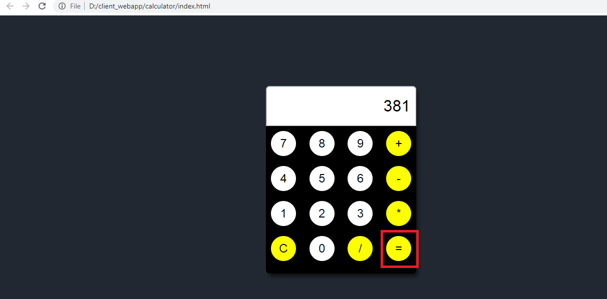
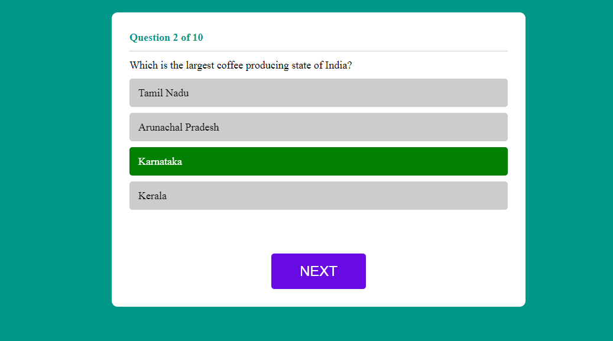

<h1 align="Center"> Client Web App</h1>

## Table of Content

* [Background](#back)
* [Calculator](#calc)
* [Quiz App ](#quiz)
* [Useful Links](#useful)

##  Background

A client web application is a web application based on client (user)-side web technologies and these application consists of the following :  

1. HTML is the standard markup language used to create web pages and web applications. 
2. CSS (Cascading Style Sheets) is used to control the look and layout of HTML elements.  
3. Java Script can use to add interactivity to web pages based on how to manipulate the HTML and CSS.

In this repository, There are 2 client based web applications,  
* Calculator  
* Quiz app - Multiple choice of Questions  

##  Calculator

In this folder, there are 3 files, which are required to create web based calculator application  
+ index.html - It is a web page, which creates calculator design  
+ main.css - Which controls the look and layout of calculator  
+ calc.js - Based on the script the calculator is working.  

* When we click on index.html, which will open the html file through internet explorer and shows the web pages as follows 

  

* we need to click on the number and need to click on mathematical operators(+, -, /, *) for mathematical operations 

  
  

The above screenshots is showing how to add two numbers in calculator and need to click on "=" to get the answer 

* Once application operations are done. we need to press on the "C" on webpage as shown below to reset the web page. 

  

##  Quiz App 

In this folder, there are 3 files, which are required to create web based calculator application  
+ quiz.html - It is a web page, which creates design for Quiz app  
+ style.css - Which controls the look and layout of Quiz app  
+ quizscript.js - Based on the script in this the Quiz App functions.  
+ question.json - This file has set of questions and answers and these are used to create quiz page.  

* When we click on quiz.html, A web page will with Question and 4 options as follows
  

* we need to chose to any one of the 4 choices, If the answer is correct the choosen option will turns to green 

  

* If choosed option is wrong, The option will turns to red and will show the correct answer with green background colour 

  

* We need to press next button to go next question 

  

* If all question gets over, the we pages prompt total scores. we can play again by pressing "Try Again" as shown in the below screen shot. 

  

<h2>Key Take-aways </h2>

+ From this repository, User can learn how to create client based application  
+ Users have experience on html files, which will helps to build web pages  
+ Users used to have control the look and layout of HTML elements using CSS file  
+ Users have hands-on experience on javascripts on html files, which will helps to manipulate html and css file  

##  Userful Links

| **Sl. No.** | **Link** | **Remarks** |
----------|--------------|--------------
1| [W3 Tutorial - CSS](https://www.w3schools.com/css/default.asp)| W3 Tutorial - CSS|
1| [W3 Tutorial - Javascript](https://www.w3schools.com/js/js_intro.asp)| W3 Tutorial- Javascript|
2| [Quiz App](https://youtu.be/J8QbjXdVl9c) | Quiz App Tutorial |